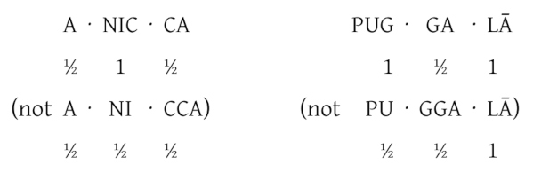

# Pāli Phonetics and Pronunciation

Pāli is the original scriptural language of Theravāda Buddhism. It was a spoken
language, closely related to Sanskrit, with no written script of its own. As
written forms have emerged, they have been in the letterings of other languages
(e.g. Devanagari, Sinhalese, Burmese, Khmer, Thai, Roman). The Roman lettering
used here is pronounced as in English, with the following clarifications:

## Vowels

| Short                 | Long                    |
|-----------------------|-------------------------|
| **a** as in **a**bout | **ā** as in f**a**ther  |
| **i** as in h**i**t   | **ī** as in mach**i**ne |
| **u** as in p**u**t   | **ū** as in r**u**le    |
|                       | **e** as in gr**e**y    |
|                       | **o** as in m**o**re    |

Exceptions: **e** and **o** change to short sounds in syllables ending in
consonants. They are then pronounced as in 'g**e**t' and '**o**x', respectively.

## Consonants

**c** as in an**c**ient (like **ch** but unaspirated)

**ṃ, ṅ** as **ng** in sa**ng**

**ñ** as **ny** in ca**ny**on

**v** rather softer than the English **v**; near **w**

### Aspirated consonants

**bh ch dh ḍh gh jh kh ph th ṭh**

These two-lettered notations with **h** denote an aspirated, airy sound,
distinct from the hard, crisp sound of the single consonant. They should be
considered as one unit.

However, the other combinations with **h,** i.e., **lh, mh, ñh,** and **vh,** do
count as two consonants (for example in the Pāli words 'ji**vh**ā' or
'mu**ḷh**o').

### Examples

**th** as **t** in **t**ongue. (Never pronounced as in '**th**e'.)

**ph** as **p** in **p**alate. (Never pronounced as in '**ph**oto'.)

These are distinct from the hard, crisp sound of the single consonant, e.g.
**th** as in '**Th**omas' (not as in '**th**in') or **ph** as in '**p**uff' (not
as in '**ph**one').

### Retroflex consonants

**ḍ ḍh ḷ ṇ ṭ ṭh**

These retroflex consonants have no English equivalents. They are sounded
by curling the tip of the tongue back against the palate.

## Chanting technique

Once you have grasped the system of Pāli pronunciation and the following
chanting technique, it allows you to chant a text in Pāli from sight with the
correct rhythm.

**Unstressed syllables** end in a short **a, i** or **u**. All other syllables
are stressed. Stressed syllables take twice the time of unstressed syllables
&ndash; rather like two beats in a bar of music compared to one. This is what
gives the chanting its particular rhythm.

Two details that are important when separating the syllables:

**1.** Syllables with double letters get divided in this way:

They are always enunciated separately, e.g. **dd** in 'uddeso' as in
'mad dog', or **gg** in 'maggo' as in 'big gun'.

**2.** **Aspirated consonants** like **bh, dh** etc. count as single
consonant and don't get divided (Therefore **am·hā·kaṃ**, but
**sa·dham·maṃ**, not **sad·ham·maṃ** or, another example: **Bud·dho**
and not **Bu·ddho**).

Precise pronunciation and correct separation of the syllables is
especially important when someone is interested in learning Pāli and to
understand and memorize the meaning of Suttas and other chants,
otherwise the meaning of it will get distorted.

**An example to illustrate this:**

The Pāli word '**sukka**' means 'bright'; '**sukkha**' means 'dry'; '**sukha**'
&ndash; 'happiness'; '**suka**' &ndash; 'parrot' and '**sūka**' &ndash;
'bristles on an ear of barley'.

So if you chant '**sukha**' with a '**k**' instead of a '**kh**', you would
chant 'parrot' instead of 'happiness'.

A general rule of thumb for understanding the practice of chanting is to listen
carefully to what the leader and the group are chanting and to follow, keeping
the same pitch, tempo and speed. All voices should blend together as one.

